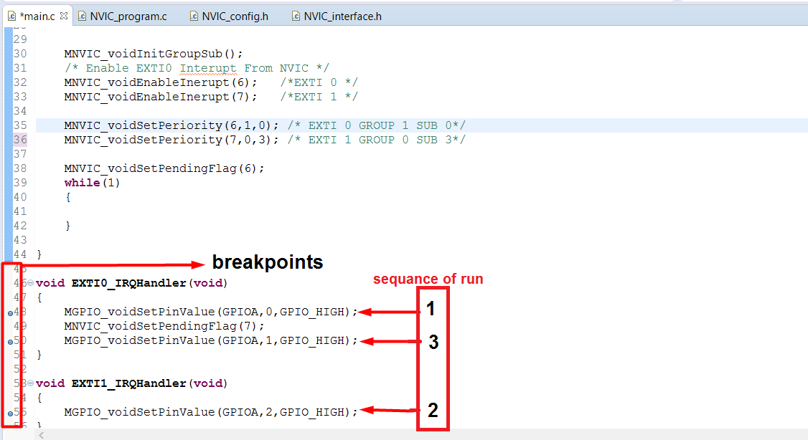

## _The work Flow Of Applications :_
### APP1_NVIC_TEST_CODE --> main.c :

* #### I change in sowftware periority between EXTI_0 and EXTI_1 
* #### the EXTI_0 higher in hardware periority than EXTI_1 but i change in sowftware periority to make EXTI_1 CUT EXTI_0 through this two step in main.c 

    1. MNVIC_voidSetPeriority(6,1,0); /* put EXTI_0 GROUP_1 SUB_GROUP_0*/
    2. MNVIC_voidSetPeriority(7,0,3); /* PIUT EXTI_1 GROUP_0 SUB_GROUP_3*/

* #### EXTI_1 happen while EXTI_0 excute and because i put EXTI_1 in GROUP periority higher than EXTI_0 his due to EXTI_1 cut EXTI_0
* #### to see the output enter debuging session and make some breakpoints in EXTI_IRQHandler and  make some leds_on and if order led_on first and third and second that indicator of the NVIC driver work perfect 

### APP2_EXTI_AFIO_NVIC_TEST_CODE -->main.c :
* #### in this app i test the AFIO and EXTI driver through simple APP by made PINA0,PINA1 handle external interupt 0,1 that fire on falling edge triger after falling edge come through external hardware such buttom on PINA0 or PINA1
* #### both external interupt 0,1 interrupt service routine task1,task2 that out high value for 5 sec on PINA3,PINA4 to see result connect 2 led on PINA3,PINA4
* #### when i change in sowftware periority to make EXTI_1 CUT EXTI_0 i face problem when i cut task1 before during excution because of cpu not make context switching and task2 put new value in system timer (STK) regester when cpu excute task2 and after 5sec SysTick_Handler excute function that it passed in task2 that make led2 off , disable SysTick interupt , stop SysTick timer and cpu not excute fun that passed in task1 and led1 still on . i will solve it later by used Real-Time Operating System (RTOS)

